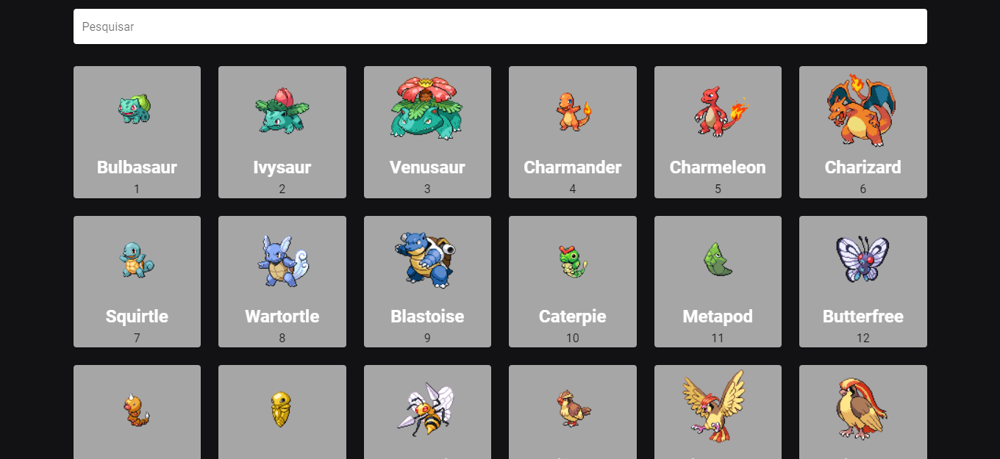

# Aplicação Vue



> Busca pelo pokemon

    Projeto construido para trazer os pokemons e suas propriedades.

## Tecnologias utilizadas
    - VueJS
    - Vuetifyjs
    - PokéAPI
    - Git
    - Github
    - Vercel

## Contato
    ngadiego@gmail.com

# search-pokemon

## Project setup
```
npm install
```

### Compiles and hot-reloads for development
```
npm run serve
```

### Compiles and minifies for production
```
npm run build
```

### Lints and fixes files
```
npm run lint
```

### Customize configuration
See [Configuration Reference](https://cli.vuejs.org/config/).
